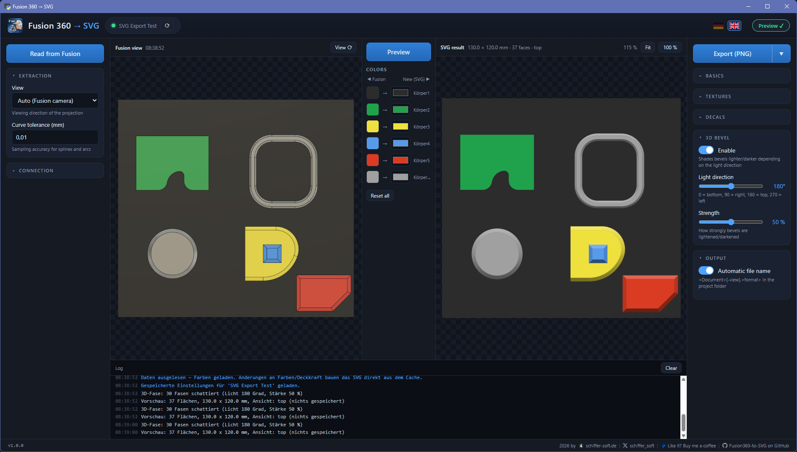
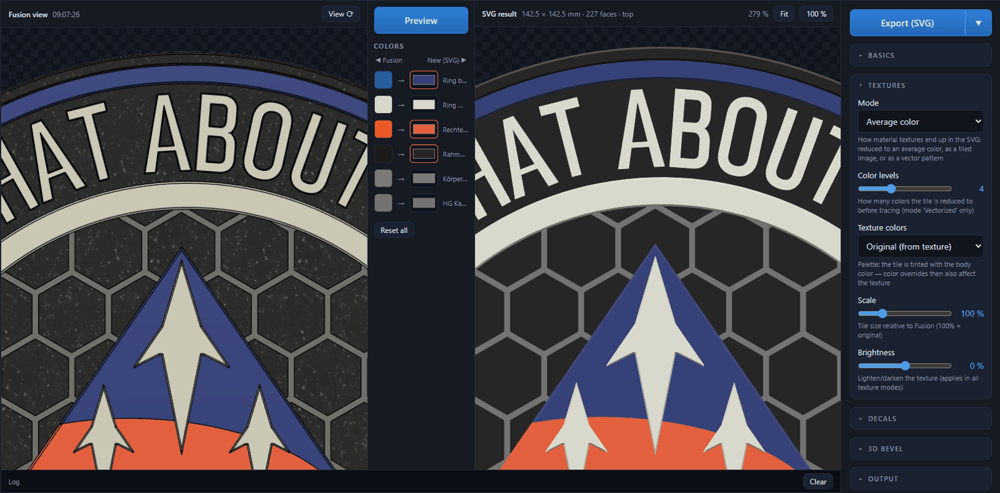
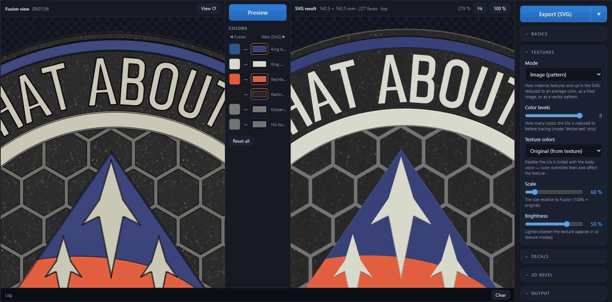
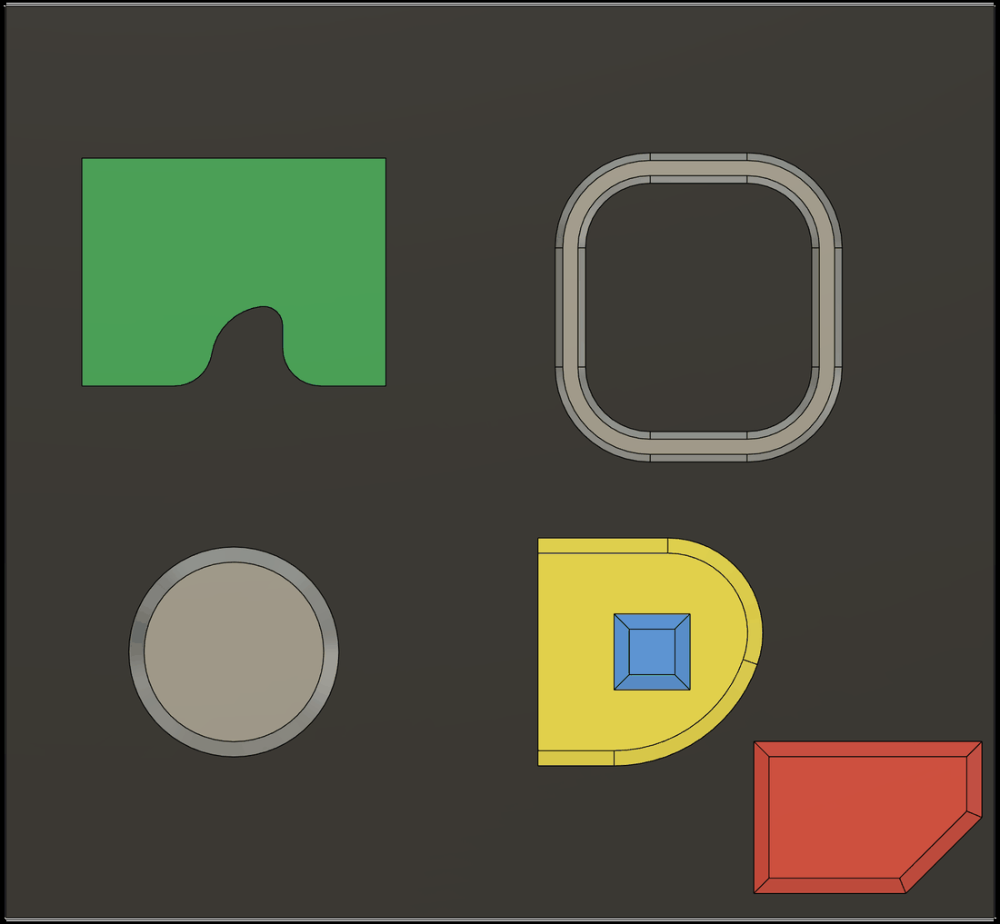
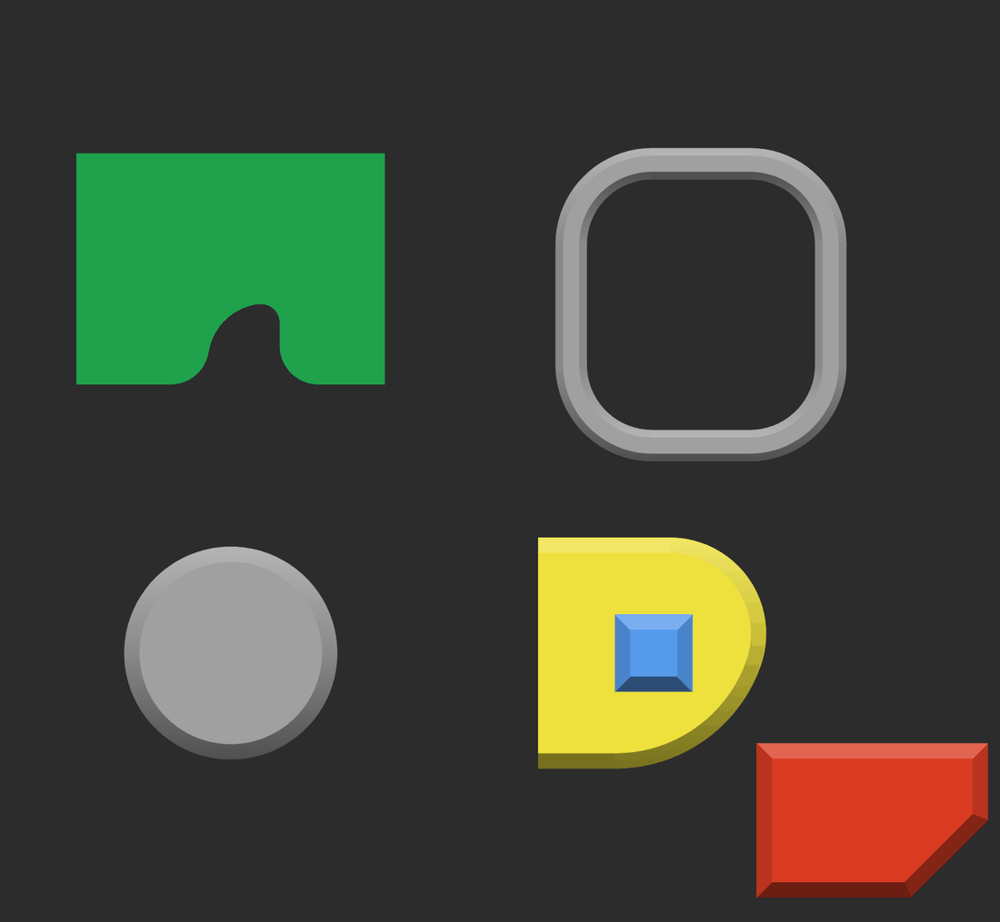

# F360toSVG



> Turn **Fusion 360** designs into layered, color-accurate **SVG** — the way the model
> actually looks, not just its outlines. Built for multi-color 3D-printed signs, badges
> and laser templates.

**[⬇ Download latest release](https://github.com/schiffer-soft/F360toSVG/releases/latest)**

[English](#english) · [Deutsch](#deutsch)

---

## English

### What it does

Fusion 360 can export sketches and outlines as SVG — but not a **colored picture of your
model**. F360toSVG does exactly that: it walks the model along your viewing direction,
takes every face that points at you, and stacks those faces back-to-front in the SVG
(painter's algorithm). Each face is filled with the real RGB color of its body appearance.

The result is a true-to-scale vector file (mm, 1:1) that looks like the rendered model —
ready for multi-color 3D-print signs, cut files, stickers, thumbnails or documentation.

| Fusion 360 | F360toSVG output |
|---|---|
|  |  |

Same colors, same textures, same layering — as a vector file.

- **Colors from Fusion** — every body's appearance color, override any of them live
- **Material textures** — as an average color, a tiled image, or traced into vector patterns
- **Decals** — embedded at the right place and size, optionally vectorized
- **3D bevel shading** — chamfers lit from a direction you choose, so edges look plastic
- **Hidden face removal** — faces nobody can see are dropped, files stay small
- **SVG, PNG, JPG, PDF, AI** — one click, 300 dpi for raster formats

### Requirements

- **Windows 11**
- **Fusion 360** running, with the design you want **open and active**
- **Fusion MCP Server enabled**: *Preferences → General → "Fusion MCP Server"*
  (default port 27182, i.e. `http://127.0.0.1:27182/mcp`)
- Nothing else — the release is a portable `.exe`, just double-click

> Microsoft Edge (pre-installed on Windows) is used for PNG/JPG/PDF/AI conversion,
> WebView2 (also standard on Windows 11) renders the interface.

### Download & Install

Download the latest `F360toSVG-X.X.X-portable.exe` from the
[Releases page](../../releases) and double-click it — no installation required.

> The executable is **not code-signed**, so Windows SmartScreen may warn on first launch:
> click *More info → Run anyway*. First start takes 2–3 seconds (it unpacks itself),
> after that it opens immediately.

Settings and color profiles are stored in
`%APPDATA%\F360toSVG\color_overrides.json`, so they survive moving the program or
switching to a newer version. The app quietly checks GitHub for a newer release about
30 seconds after start and, if there is one, shows a small hint in the footer — no popup,
no nagging.

### How to use it

The window is split in three: Fusion options on the left, the two previews with the color
palette in the middle, SVG options on the right.

---

#### Step 1 — Read from Fusion

Set the view you want in Fusion (ViewCube), then click **Read from Fusion**.

The tool grabs a viewport screenshot and extracts all visible faces. Progress runs live in
the log, and the SVG preview builds up body by body while extraction is still going. When
it's done the color palette is filled and the first preview appears automatically.

The **View** option decides the direction: `Auto` follows the current Fusion camera and
snaps to the nearest of the six axis views — or pick one explicitly (top, bottom, front,
back, right, left).

---

#### Step 2 — Tune it live

Everything you change now rebuilds the preview from the cache in about 0.05 seconds —
**nothing is written to disk** during this stage:

- **Colors** — the palette in the middle lists every Fusion color with the bodies using it.
  Pick a new color on the right, click the original swatch on the left to reset.
- **Textures** — average color, tiled image, or vectorized pattern (see below)
- **Decals** — opacity, or trace them into vector paths
- **3D bevel** — enable it, set light direction and strength
- **Hidden faces** — remove faces that are completely covered (on by default)
- **Seam stroke** — hides antialiasing hairlines between adjacent faces

Both previews are **coupled**: zoom with the mouse wheel, drag to pan — Fusion view and SVG
result move together, so you can compare them 1:1. The SVG re-renders sharply at every zoom
level. Right-click either preview to copy or save the image.

---

#### Step 3 — Export

**Export** reads the current state fresh from Fusion and writes the file. The ▼ arrow next
to the button only *selects* the format:

| Format | What you get |
|--------|--------------|
| **SVG** | vector, the native output |
| **PNG** | 300 dpi raster, transparent background |
| **JPG** | 300 dpi raster, white background |
| **PDF** | vector |
| **AI** | Illustrator — technically a vector PDF with an `.ai` extension |

For everything except SVG the SVG file is written as well.

All settings and color overrides are saved **per Fusion document** and restored
automatically the next time you read that same design.

### Features in detail

#### Textures

If a body's appearance uses an image texture instead of a plain color, you have three modes:

| Mode | Result |
|------|--------|
| **Average color** | the texture is reduced to its average color (default) |
| **Image (pattern)** | the tile is embedded as PNG and tiled — exact, but pixelated when zoomed far in |
| **Vectorized** | the tile is reduced to a few colors and traced into vector paths — scales losslessly |

*Average color* — the speckled carbon look becomes a flat dark surface:



*Image (pattern)* — the original tile, placed as in Fusion:



*Vectorized* — traced tile, here at 60 % scale and +55 % brightness:


Tile size, rotation and the anchor point of the tiling grid are read from Fusion, so the
pattern sits where it does in the model. **Scale** (10–400 %) and **Brightness**
(−100…+100 %) let you adapt it, and **Texture colors** decides whether the original image
colors are kept or the tile is tinted with the body color — with tinting, your palette
overrides affect the texture too.

#### Decals

Visible decals are embedded as real images (base64, full resolution), placed and sized from
the decal transform, clipped to their carrier face, with the opacity from Fusion (or your
own). **Vectorize** traces them into paths instead, which keeps the whole SVG vector-based —
best for flat-color artwork; photos should stay as images.

#### 3D bevel

Shades chamfers with a Lambert lighting model so edges look three-dimensional: bevels facing
the light get brighter than the top face, those facing away get darker. **Light direction**
runs 0–360° (0 = bottom, 90 = right, 180 = top, 270 = left), **Strength** 0–100 %.

Ring chamfers around cylindrical edges get a real gradient along the light direction, so a
knob or a rounded corner looks like a rendered part rather than a flat ring. On textured
bodies the bevels stay pattern-free and show the shaded average color instead.

| Fusion 360 | SVG with 3D bevel |
|---|---|
|  |  |

#### Hidden face removal

The painter's algorithm would keep faces that are completely covered by nearer ones — the
front of a backplate, for example. This option drops them. The visible result is pixel
identical; on a test badge it went from 629 to 308 faces and the file got ~27 % smaller.

### Command line

The exporter also works headless, without the GUI:

```bash
python export_svg.py                        # view from the Fusion camera (auto)
python export_svg.py --view front           # fixed front view
python export_svg.py -o drawing.svg         # custom file name
python export_svg.py --seam-mm 0            # no seam stroke (dimensionally exact)
python export_svg.py --texture-mode vector  # trace material textures
```

| Option | Default | Meaning |
|---|---|---|
| `-o`, `--output` | `<document>[-<view>].svg` | target SVG file |
| `--view` | `auto` | `auto`, `top`, `bottom`, `front`, `back`, `right`, `left` |
| `--seam-mm` | `0.1` | seam stroke width in mm, `0` = off |
| `--tol-mm` | `0.01` | curve sampling tolerance in mm |
| `--decal-opacity` | from Fusion | override opacity of all decals (0..1) |
| `--trace-decals` | off | trace decals into vector paths |
| `--texture-mode` | `color` | `color`, `image`, `vector` |
| `--texture-colors` | `4` | color levels when tracing textures (2..16) |
| `--texture-recolor` | `original` | `palette` tints the tile with the body color |
| `--texture-scale` | `100` | tile size in percent of the Fusion size |
| `--texture-brightness` | `0` | texture brightness in percent (−100..+100) |
| `--url` | `http://127.0.0.1:27182/mcp` | Fusion MCP server URL |
| `--dump-json` | – | also save the extracted raw data as JSON |

Running from source needs Python 3.10+ (64-bit) plus `pywebview`, `Pillow`, `shapely` and
`vtracer`. Each package only gates its own feature — without it you get a warning in the
log and the rest keeps working. `build_exe.bat` builds the portable executable.

### How it works

The tool talks to the local **Fusion MCP Server** and sends a Python script into Fusion's
own API. There it collects every face whose normal points at the viewer, samples the
boundary curves into polylines and projects them onto the image plane. Back on your machine
those contours are sorted by depth and drawn back-to-front, holes cut out via
`fill-rule="evenodd"`. Each path carries `data-body` and `data-z-mm` attributes, so you can
always tell which face came from where.

Technical details are documented in [docs/ARCHITECTURE.md](docs/ARCHITECTURE.md) (German).

### Known limitations

- **Spheres, tori, freeform faces** — the projected *boundary* of a face is drawn, not its
  true *silhouette*. Correct for a hemisphere (equator), wrong for a lying cylinder.
- **Same-colored details disappear** — a blind hole in a green body only shows where a
  differently colored body shines through. It's flat-color logic, not a renderer.
- **Overlapping bodies in the same depth range** — the stacking order is undefined there
  (only affects bodies that intersect each other).
- **Fusion visibility counts** — hidden bodies (light bulb off) are skipped.

### Troubleshooting

| Message | Cause / fix |
|---|---|
| `... nicht erreichbar` | Is Fusion running? MCP server enabled in preferences? Right port? |
| `Kein aktives Design` | Open or activate a design document in Fusion |
| `Keine ... Flächen gefunden` | All bodies hidden, or the design is empty |
| `Skriptfehler in Fusion: ...` | Read the traceback — it comes from the extraction script inside Fusion's API |

### Support

If this tool saves you time, a small donation is appreciated:

[☕ Buy me a coffee (PayPal)](https://www.paypal.me/schiffersoft)

### License

GPL v3 — see [LICENSE](LICENSE).
Copyright (C) 2026 Christian Schiffer | schiffer-soft

---
---

## Deutsch

**[⬇ Neueste Version herunterladen](https://github.com/schiffer-soft/F360toSVG/releases/latest)**

### Was es macht

Fusion 360 kann Skizzen und Umrisse als SVG exportieren — aber kein **farbiges Abbild
deines Modells**. Genau das macht F360toSVG: Es geht das Modell entlang der Blickrichtung
durch, nimmt jede Fläche, die zum Betrachter zeigt, und stapelt diese Flächen im SVG von
hinten nach vorn (Painter's Algorithm). Jede Fläche wird mit dem echten RGB-Wert der
Appearance ihres Körpers gefüllt.

Heraus kommt eine maßstabsgetreue Vektordatei (mm, 1:1), die aussieht wie das gerenderte
Modell — fertig für Multi-Color-3D-Druck-Schilder, Schnittdateien, Aufkleber, Vorschaubilder
oder Dokumentation.

| Fusion 360 | Ergebnis von F360toSVG |
|---|---|
|  |  |

Gleiche Farben, gleiche Texturen, gleiche Schichtung — als Vektordatei.

- **Farben aus Fusion** — jede Appearance-Farbe, jede davon live überschreibbar
- **Material-Texturen** — als Durchschnittsfarbe, gekacheltes Bild oder Vektor-Muster
- **Aufkleber** — an der richtigen Stelle und Größe eingebettet, optional vektorisiert
- **3D-Fasen-Schattierung** — Fasen aus wählbarer Lichtrichtung, Kanten wirken plastisch
- **Verdeckte Flächen entfernen** — was niemand sieht, fliegt raus, die Datei bleibt klein
- **SVG, PNG, JPG, PDF, AI** — ein Klick, Rasterformate mit 300 dpi

### Voraussetzungen

- **Windows 11**
- **Fusion 360** läuft, mit dem gewünschten Design **geöffnet und aktiv**
- **Fusion MCP Server aktiviert**: *Voreinstellungen → Allgemein → „Fusion MCP Server"*
  (Standard-Port 27182, also `http://127.0.0.1:27182/mcp`)
- Sonst nichts — die Release-Datei ist eine portable `.exe`, einfach doppelklicken

> Microsoft Edge (auf Windows vorinstalliert) übernimmt die PNG/JPG/PDF/AI-Konvertierung,
> WebView2 (ebenfalls Windows-11-Standard) rendert die Oberfläche.

### Download & Installation

Lade die aktuelle `F360toSVG-X.X.X-portable.exe` von der
[Releases-Seite](../../releases) herunter und doppelklick sie — keine Installation nötig.

> Die Datei ist **nicht signiert**, Windows SmartScreen warnt deshalb beim ersten Start:
> *Weitere Informationen → Trotzdem ausführen*. Der erste Start dauert 2–3 Sekunden
> (Selbstentpacken), danach öffnet das Fenster sofort.

Einstellungen und Farbprofile liegen in
`%APPDATA%\F360toSVG\color_overrides.json` und überleben damit das Verschieben des
Programms und den Wechsel auf eine neuere Version. Etwa 30 Sekunden nach dem Start prüft
das Programm still, ob es auf GitHub eine neuere Version gibt, und zeigt gegebenenfalls
einen kleinen Hinweis in der Fußzeile — kein Popup, kein Nerven.

### Bedienung

Das Fenster ist dreigeteilt: links die Fusion-Optionen, in der Mitte die beiden Vorschauen
mit der Farbpalette, rechts die SVG-Optionen.

---

#### Schritt 1 — Auslesen aus Fusion

Stell in Fusion die gewünschte Ansicht ein (ViewCube) und klick **Auslesen aus Fusion**.

Das Tool holt einen Viewport-Screenshot und extrahiert alle sichtbaren Flächen. Der
Fortschritt läuft live im Protokoll, und die SVG-Vorschau baut sich Körper für Körper auf,
während die Extraktion noch läuft. Danach ist die Farbpalette gefüllt und die erste Vorschau
erscheint automatisch.

Die Option **Ansicht** bestimmt die Blickrichtung: `Auto` folgt der aktuellen Fusion-Kamera
und schnappt auf die nächstliegende der sechs Achsansichten — oder du wählst fest aus
(oben, unten, vorne, hinten, rechts, links).

---

#### Schritt 2 — Live einstellen

Alles, was du jetzt änderst, baut die Vorschau in etwa 0,05 Sekunden aus dem Cache neu —
**dabei wird nichts gespeichert**:

- **Farben** — die Palette in der Mitte listet jede Fusion-Farbe mit den Körpern, die sie
  benutzen. Rechts neue Farbe wählen, Klick auf das Original links setzt zurück.
- **Texturen** — Durchschnittsfarbe, gekacheltes Bild oder Vektor-Muster (siehe unten)
- **Aufkleber** — Deckkraft, oder als Vektorpfade tracen
- **3D Fase** — aktivieren, Lichtrichtung und Stärke einstellen
- **Verdeckte Flächen** — komplett überdeckte Flächen entfernen (Standard an)
- **Naht-Stroke** — überdeckt Antialiasing-Haarlinien zwischen angrenzenden Flächen

Beide Vorschauen sind **gekoppelt**: Mausrad zoomt, Ziehen verschiebt — Fusion-Ansicht und
SVG-Ergebnis laufen synchron, du kannst also 1:1 vergleichen. Das SVG wird bei jeder
Zoomstufe scharf nachgerendert. Rechtsklick auf eine Vorschau kopiert oder speichert das Bild.

---

#### Schritt 3 — Exportieren

**Exportieren** liest den aktuellen Stand frisch aus Fusion und schreibt die Datei. Der
▼-Pfeil daneben *wählt nur* das Format:

| Format | Ergebnis |
|--------|----------|
| **SVG** | Vektor, das eigentliche Ausgabeformat |
| **PNG** | 300 dpi Raster, transparenter Hintergrund |
| **JPG** | 300 dpi Raster, weißer Hintergrund |
| **PDF** | Vektor |
| **AI** | Illustrator — technisch ein Vektor-PDF mit `.ai`-Endung |

Bei allem außer SVG wird die SVG-Datei zusätzlich geschrieben.

Alle Einstellungen und Farbanpassungen werden **pro Fusion-Dokument** gespeichert und beim
nächsten Auslesen derselben Zeichnung automatisch wiederhergestellt.

### Die Funktionen im Detail

#### Texturen

Nutzt die Appearance eines Körpers eine Bild-Textur statt einer einfachen Farbe, hast du
drei Modi:

| Modus | Ergebnis |
|-------|----------|
| **Durchschnittsfarbe** | Die Textur wird auf ihre Durchschnittsfarbe eingedampft (Standard) |
| **Bild (Muster)** | Die Kachel wird als PNG eingebettet und gekachelt — exakt, aber beim starken Zoomen pixelig |
| **Vektorisiert** | Die Kachel wird auf wenige Farben reduziert und zu Vektorpfaden getract — skaliert verlustfrei |

*Durchschnittsfarbe* — aus der gesprenkelten Carbon-Optik wird eine glatte dunkle Fläche:


*Bild (Muster)* — die Originalkachel, platziert wie in Fusion:


*Vektorisiert* — getracte Kachel, hier mit 60 % Skalierung und +55 % Helligkeit:


Kachelgröße, Drehung und der Ankerpunkt des Kachelrasters kommen aus Fusion, das Muster
sitzt also dort, wo es im Modell sitzt. **Skalierung** (10–400 %) und **Helligkeit**
(−100…+100 %) passen es an, und **Texturfarben** entscheidet, ob die Originalfarben des
Bildes bleiben oder die Kachel mit der Körperfarbe eingefärbt wird — beim Einfärben wirken
deine Palette-Überschreibungen auch auf die Textur.

#### Aufkleber

Sichtbare Aufkleber werden als echte Bilder eingebettet (base64, volle Auflösung), Lage und
Größe kommen aus der Decal-Transformation, das Bild wird auf seine Trägerfläche geclippt,
die Deckkraft kommt aus Fusion (oder von dir). **Vektorisieren** tract sie stattdessen zu
Pfaden, dann bleibt das gesamte SVG vektorbasiert — ideal für Flachfarben-Grafiken; Fotos
bleiben besser Bilder.

#### 3D Fase

Schattiert Fasen nach einem Lambert-Lichtmodell, sodass Kanten plastisch wirken: Fasen zum
Licht werden heller als die Deckfläche, abgewandte dunkler. **Lichtrichtung** 0–360°
(0 = unten, 90 = rechts, 180 = oben, 270 = links), **Stärke** 0–100 %.

Ringfasen an Zylinderkanten bekommen einen echten Verlauf entlang der Lichtrichtung — ein
Drehknopf oder eine gerundete Ecke sieht dadurch aus wie ein gerendertes Teil und nicht wie
ein flacher Ring. Bei texturierten Körpern bleiben die Fasen musterfrei und zeigen die
schattierte Durchschnittsfarbe.

| Fusion 360 | SVG mit 3D Fase |
|---|---|
|  |  |

#### Verdeckte Flächen entfernen

Der Painter's Algorithm würde auch Flächen behalten, die komplett von näher liegenden
überdeckt sind — etwa die Vorderseite einer Rückplatte. Diese Option wirft sie raus. Das
sichtbare Ergebnis ist pixelidentisch; beim Test-Badge waren es 629 → 308 Flächen und die
Datei wurde rund 27 % kleiner.

### Kommandozeile

Der Exporter läuft auch ohne GUI:

```bash
python export_svg.py                        # Ansicht aus der Fusion-Kamera (auto)
python export_svg.py --view front           # feste Vorderansicht
python export_svg.py -o zeichnung.svg       # eigener Dateiname
python export_svg.py --seam-mm 0            # ohne Naht-Stroke (maßhaltig)
python export_svg.py --texture-mode vector  # Material-Texturen vektorisieren
```

| Option | Standard | Bedeutung |
|---|---|---|
| `-o`, `--output` | `<Dokument>[-<Ansicht>].svg` | Ziel-SVG-Datei |
| `--view` | `auto` | `auto`, `top`, `bottom`, `front`, `back`, `right`, `left` |
| `--seam-mm` | `0.1` | Breite des Naht-Strokes in mm, `0` = aus |
| `--tol-mm` | `0.01` | Sampling-Toleranz für Kurven in mm |
| `--decal-opacity` | Wert aus Fusion | Deckkraft aller Aufkleber überschreiben (0..1) |
| `--trace-decals` | aus | Aufkleber zu Vektorpfaden tracen |
| `--texture-mode` | `color` | `color`, `image`, `vector` |
| `--texture-colors` | `4` | Farbstufen beim Textur-Tracen (2..16) |
| `--texture-recolor` | `original` | `palette` färbt die Kachel mit der Körperfarbe ein |
| `--texture-scale` | `100` | Kachelgröße in Prozent der Fusion-Größe |
| `--texture-brightness` | `0` | Textur-Helligkeit in Prozent (−100..+100) |
| `--url` | `http://127.0.0.1:27182/mcp` | URL des Fusion MCP Servers |
| `--dump-json` | – | extrahierte Rohdaten zusätzlich als JSON speichern |

Aus dem Quellcode gestartet braucht es Python 3.10+ (64-bit) sowie `pywebview`, `Pillow`,
`shapely` und `vtracer`. Jedes Paket schaltet nur sein eigenes Feature frei — fehlt es,
gibt es eine Warnung im Protokoll und der Rest läuft weiter. `build_exe.bat` baut die
portable EXE.

### Wie es funktioniert

Das Tool spricht mit dem lokalen **Fusion MCP Server** und schickt ein Python-Skript in
Fusions eigene API. Dort werden alle Flächen gesammelt, deren Normale zum Betrachter zeigt,
die Randkurven zu Polylinien abgetastet und auf die Bildebene projiziert. Zurück auf deinem
Rechner werden diese Konturen nach Tiefe sortiert und von hinten nach vorn gezeichnet,
Löcher per `fill-rule="evenodd"` ausgespart. Jeder Pfad trägt `data-body` und `data-z-mm`,
sodass immer nachvollziehbar bleibt, welche Fläche woher stammt.

Die technischen Details stehen in [docs/ARCHITECTURE.md](docs/ARCHITECTURE.md).

### Grenzen

- **Kugeln, Tori, Freiformflächen** — gezeichnet wird die projizierte *Randkontur* einer
  Fläche, nicht ihre echte *Silhouette*. Bei einer Halbkugel stimmt das (Äquator), bei einem
  liegenden Zylinder nicht.
- **Gleichfarbige Details verschwinden** — ein Sackloch im grünen Körper ist nur sichtbar,
  wo ein andersfarbiger Körper durchscheint. Reine Flachfarben-Logik, kein Renderer.
- **Überlappende Körper im selben Tiefenbereich** — die Reihenfolge ist dort nicht eindeutig
  (betrifft nur sich durchdringende Körper).
- **Es zählt die Sichtbarkeit in Fusion** — ausgeblendete Körper (Glühbirne aus) werden
  übersprungen.

### Fehlerbilder

| Meldung | Ursache / Lösung |
|---|---|
| `... nicht erreichbar` | Fusion gestartet? MCP Server in den Voreinstellungen aktiviert? Port richtig? |
| `Kein aktives Design` | In Fusion ein Design-Dokument öffnen/aktivieren |
| `Keine ... Flächen gefunden` | Alle Körper ausgeblendet oder leeres Design |
| `Skriptfehler in Fusion: ...` | Traceback lesen — der Fehler stammt aus dem Extraktionsskript in Fusions API |

### Unterstützung

Wenn dir das Tool Zeit spart, freue ich mich über eine kleine Spende:

[☕ Spendier mir einen Kaffee (PayPal)](https://www.paypal.me/schiffersoft)

### Lizenz

GPL v3 — siehe [LICENSE](LICENSE).
Copyright (C) 2026 Christian Schiffer | schiffer-soft
